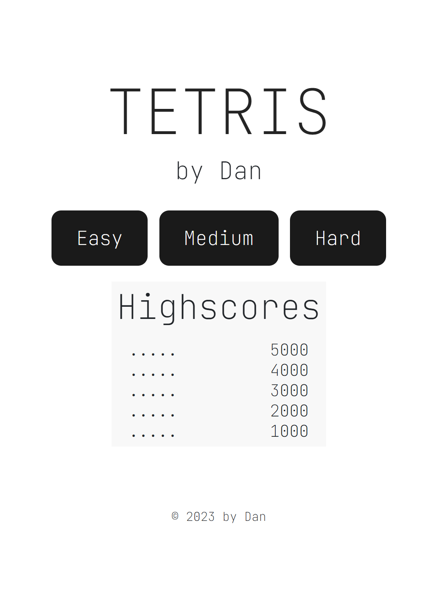
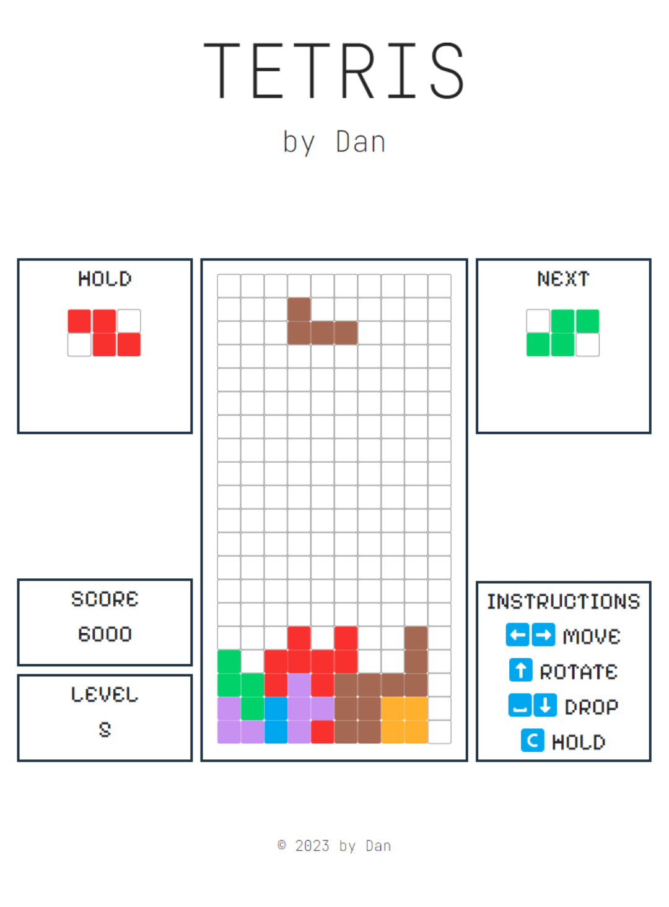

#  [Tetris by Dan!](https://tetris-by-dan.vercel.app/) 


## Overview
Welcome to [Tetris by Dan](https://tetris-by-dan.vercel.app/)! This project is an implementation of Tetris using Javascript and DOM Manipulation. It aims to reignite the nostalgia of playing Tetris on arcade machines, where players arrange falling shapes (Tetrimonoes) to create complete rows.

## Gameplay




## Features
- A mix of Classic Tetris with some modern quality-of-life features such as the **hold** function
- Keyboard controls (move left, move right, rotate, soft drop, hard drop)
- Score tracking referencing Original SEGA scoring system
- Level progression (gameplay speeds up as more rows are cleared)
- Local highscore tracking system

## Technologies Used
- Vanilla Javascript
- HTML / CSS for game display and layout

## How to Play
- Left Arrow / ```A``` - Move Left
- Right Arrow / ```D``` - Move Right
- Up Arrow / ```W``` - Rotate Clockwise
- Down Arrow / ```S``` - Soft Drop
- ```SPACE``` - Hard Drop
- ```C``` - Hold

## Goal
Arrange the falling Tetrimonoes to fill complete rows. Clearing more than 1 row in a single move will earn extra points. As the game progresses, the Tetrimonoes will fall with increased speed. Once the Tetrimonoes reach the top, the game is over.

## Next Steps
- "Ghost tile" feature - outline of falling tetrimono is shown at the bottom of the board
- Dark mode
- Soundtrack
- Global leaderboard

## Credits
The original Tetris was created by Alexey Leonidovich Pajitnov.
Rules and guidelines were referenced from the [Tetris Wiki Page](https://tetris.wiki/Tetris_Guideline).

